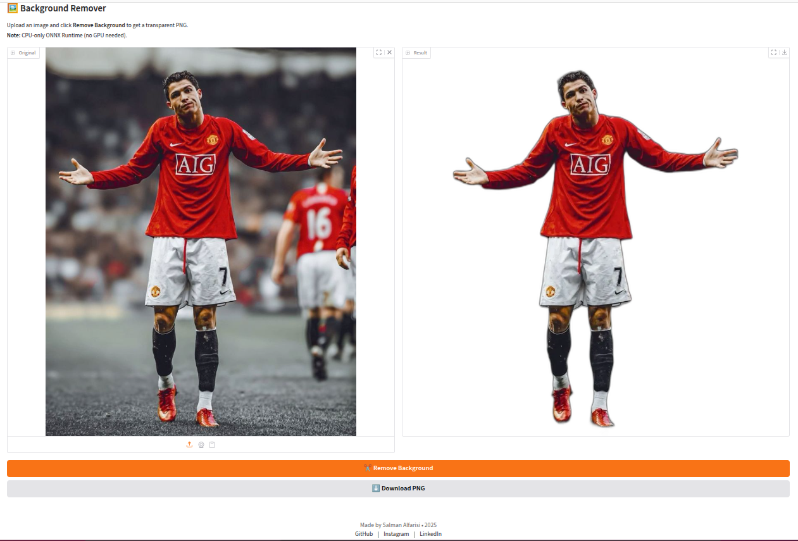

# 🖼️ Remove-Background App

A simple, CPU-only Gradio web application that lets you upload an image, remove its background, and download the result as a transparent-PNG. Designed for ease of use and zero GPU requirements.

[](https://huggingface.co/spaces/salman555/Background-Remover)
[](https://huggingface.co/spaces/salman555/Background-Remover)


---

## 📑 Table of Contents

1. [Features](#features)  
2. [Project Structure](#project-structure)  
3. [Prerequisites](#prerequisites)  
4. [Installation](#installation)  
5. [Running Locally](#running-locally)  
6. [Usage](#usage)  
7. [Contributing](#contributing)  
8. [License](#license)  
9. [Author & Credits](#author--credits)  

---

## ✨ Features

- **Background Removal**  
  Instantly strips the background from any image using the lightweight `rembg` ONNX model.

- **CPU-Only**  
  No GPU required—runs entirely on CPU for maximum portability.

- **Live Preview & Download**  
  See the transparent result in the browser and download as a PNG.

<p align="center">
  
</p>

---

## 📁 Project Structure

```
remove-bg-app/
├── app.py
├── requirements.txt
├── .gitignore
├── LICENSE
└── README.md
```

---


---

## ⚙️ Prerequisites

- Python 3.8 or higher  
- `pip` package manager  

---

## 🔧 Installation

1. Clone this repository:

   ```bash
   git clone https://github.com/salman555/remove-bg-app.git
   cd remove-bg-app
   ```

2. Create and activate a virtual environment:

   ```bash
   python -m venv .venv
   source .venv/bin/activate   # Linux/macOS
   .venv\Scripts\activate      # Windows
   ```

3. Install dependencies:

   ```bash
   pip install -r requirements.txt
   ```

## 🚀 Running Locally

Launch the app on your machine:
   ```bash
   python app.py
   ```
By default it will start on http://127.0.0.1:7860/. Open that URL in your browser to access the interface.

## 🎯 Usage

1. Upload an image in the Original pane.
2. Click Remove Background.
3. View the result in the Result pane.
4. Click Download PNG to save your transparent-background image.

## 🤝 Contributing
Contributions, bug reports and feature requests are welcome!

## 📄 License

This project is licensed under the [MIT License](LICENSE).

---

## 🖋️ Author & Credits

Developed by **[Salman Alfarisi](https://github.com/salmanalfarisi11)** © 2025  
- GitHub: [salmanalfarisi11](https://github.com/salmanalfarisi11)  
- LinkedIn: [salmanalfarisi11](https://linkedin.com/in/salmanalfarisi11)  
- Instagram: [faris.salman111](https://instagram.com/faris.salman111)  

Built with ❤️ and Gradio
Feel free to ⭐ the repo and share feedback!

